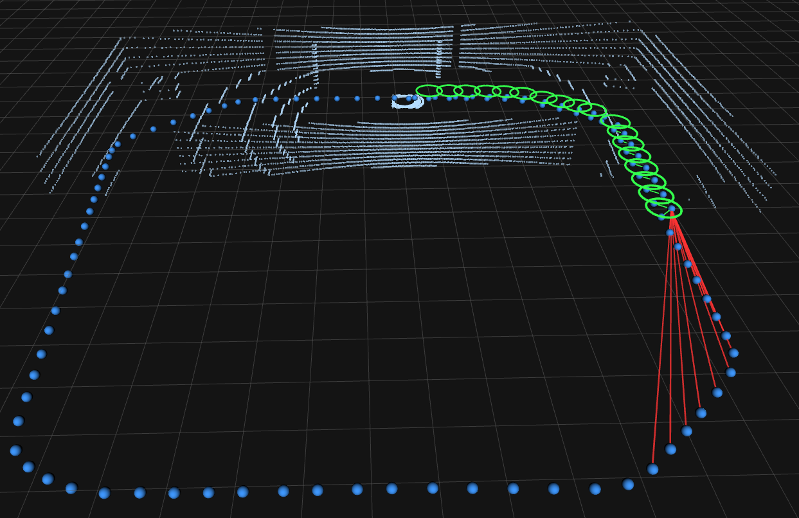
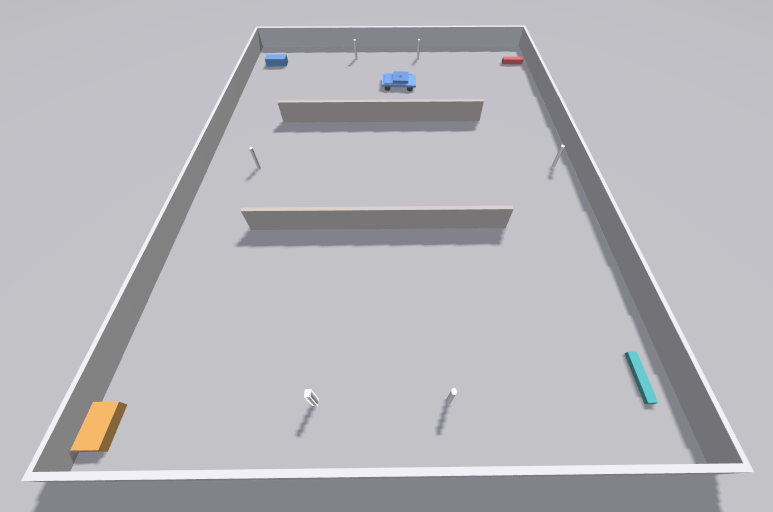

# ros2_factor_graph_viz

RViz2 plugin for visualizing SLAM pose graphs in real time. Shows keyframe poses, accepted loop closures, and rejected loop closure candidates as they happen.

Implemented for [LIO-SAM](https://github.com/TixiaoShan/LIO-SAM/tree/ros2) via a small patch to `mapOptmization.cpp` that hooks into the keyframe creation, loop closure detection, and pose correction steps. The patch publishes the full graph state to a `/factor_graph` topic which the RViz2 plugin subscribes to.

## Plugin visuals

| Visual | Meaning |
|---|---|
| Blue sphere | Keyframe pose — position is always the latest optimizer-corrected estimate |
| Green ring | Accepted loop closure — drawn around the query keyframe (the current keyframe that recognised a previously visited place) |
| Green line | Edge connecting the matched candidate keyframe to the query keyframe |
| Red line | Rejected loop closure — two places that look identical but ICP failed to confirm |


### Visualizer example


### World example


---

## Packages

| Package | Description |
|---|---|
| `factor_graph_msgs` | ROS 2 message definitions + `FactorGraphPublisher` header-only helper |
| `factor_graph_rviz_plugin` | RViz2 Display plugin that renders the pose graph in 3D |
| `slam_adapters` | Ring preprocessor, LIO-SAM config, and launch file (reference integration for Gazebo sim) |

---

## Folder structure

```
~/
├── ros2_factor_graph_viz/        ← this repo
│   ├── src/
│   │   ├── factor_graph_msgs/
│   │   ├── factor_graph_rviz_plugin/
│   │   └── slam_adapters/
│   └── patches/
│       └── lio_sam_factor_graph.patch
│
├── lio_sam_fg/                   ← vanilla LIO-SAM with patch applied
│
└── my_robot_ws/                  ← your own workspace (anywhere on the filesystem)
    └── src/
        └── my_robot_world/
```

Your robot workspace is completely independent — it can live anywhere. The only connection between the three workspaces is ROS topics, configured in `slam_adapters/config/lio_sam_sim.yaml`.

---

## Quickstart

### 1. Clone and build this repo

```bash
git clone <this-repo> ~/ros2_factor_graph_viz
cd ~/ros2_factor_graph_viz
source /opt/ros/humble/setup.bash
colcon build --cmake-args -DCMAKE_BUILD_TYPE=RelWithDebInfo
source install/setup.bash
```

### 2. Clone LIO-SAM and apply the patch

The patch adds the factor graph publisher hooks to LIO-SAM. It touches three files: `mapOptmization.cpp`, `CMakeLists.txt`, and `package.xml`.

```bash
git clone -b ros2 https://github.com/TixiaoShan/LIO-SAM.git ~/lio_sam_fg
cd ~/lio_sam_fg
git apply ~/ros2_factor_graph_viz/patches/lio_sam_factor_graph.patch
```

### 3. Build LIO-SAM

Source this repo first so LIO-SAM can find `factor_graph_msgs`.

```bash
cd ~/lio_sam_fg
source /opt/ros/humble/setup.bash
source ~/ros2_factor_graph_viz/install/setup.bash
colcon build --packages-select lio_sam --cmake-args -DCMAKE_BUILD_TYPE=RelWithDebInfo
source install/setup.bash
```

### 4. Configure for your robot

#### `slam_adapters/config/lio_sam_sim.yaml`

At minimum change the topic names and frame names to match your setup:

```yaml
# --- Topics --- match these to what your robot publishes
pointCloudTopic: "/lidar/points_lio"    # see ring preprocessor note below
imuTopic: "/imu/data"                   # your IMU topic

# --- Frames --- match these to your TF tree
lidarFrame: "lidar_car/base_link/lidar"
odometryFrame: "odom"
mapFrame: "map"

# --- LiDAR geometry --- only change if your sensor differs from a VLP-16
N_SCAN: 16          # number of vertical beams
Horizon_SCAN: 720   # horizontal samples per revolution
```

Everything else (noise values, voxel sizes, loop closure thresholds) can stay as-is to start.

To find your frame names, run this while your robot or simulation is running:

```bash
ros2 run tf2_tools view_frames
```

It generates a PDF showing your full TF tree with all frame names.

#### `slam_adapters/launch/lio_sam.launch.py`

**Gazebo / no ring field** — keep the ring preprocessor, just change the input topic to match your raw LiDAR topic:

```python
remappings=[
    ('input',  '/your/raw/lidar/topic'),  # ← your raw LiDAR topic
    ('output', '/lidar/points_lio'),      # ← must match pointCloudTopic in yaml
],
```

**Real Velodyne / ring field already present** — remove the ring preprocessor entirely:

1. Delete the `ring_prep` node block
2. Remove `ring_prep` from the `LaunchDescription` list
3. Set `pointCloudTopic` in the yaml directly to your LiDAR topic (e.g. `/velodyne_points`)
4. Set `use_sim_time: False`

### 5. Launch

```bash
# Terminal 1 — start your robot or simulation
# (source and launch your own robot/sim here)

# Terminal 2 — start LIO-SAM
source /opt/ros/humble/setup.bash
source ~/ros2_factor_graph_viz/install/setup.bash
source ~/lio_sam_fg/install/setup.bash
ros2 launch slam_adapters lio_sam.launch.py
```

### 6. Add the display in RViz2

Click **Add → By topic → `/factor_graph` → FactorGraphDisplay**.

---

## What the patch changes in LIO-SAM

The patch is at `patches/lio_sam_factor_graph.patch`. It adds hooks into three functions in `src/mapOptmization.cpp` — nothing else is changed.

### `FactorGraphPublisher` helper

Included from `factor_graph_msgs`:

```cpp
#include <factor_graph_publisher.hpp>
```

| Method | When to call |
|---|---|
| `upsert_pose(id, x, y, z, qw, qx, qy, qz)` | On keyframe creation and after every PGO correction |
| `add_loop_closure(id_from, id_to)` | When ICP passes — loop closure accepted |
| `add_rejected(id_from, id_to)` | When ICP fails — loop closure rejected |
| `publish(stamp)` | After every SLAM update |

`upsert_pose` inserts a new node if the ID is new, or overwrites the position if it already exists — so the same call handles both initial creation and post-optimization correction.

### Hook locations

**Member variable** (`~line 155`)
```cpp
std::unique_ptr<factor_graph_viz::FactorGraphPublisher> fg_pub_;
```

**Constructor** (`~line 159`)
```cpp
fg_pub_ = std::make_unique<factor_graph_viz::FactorGraphPublisher>(
    this, "/factor_graph", odometryFrame);
```

**Rejected loop closure** — `performLoopClosureThread()` (`~line 579`)
```cpp
if (icp.hasConverged() == false || icp.getFitnessScore() > historyKeyframeFitnessScore)
{
    fg_pub_->add_rejected(loopKeyPre, loopKeyCur);
    return;
}
```

**Accepted loop closure** — `performLoopClosureThread()` (`~line 616`)
```cpp
loopIndexContainer[loopKeyCur] = loopKeyPre;
fg_pub_->add_loop_closure(loopKeyPre, loopKeyCur);
```

**New keyframe** — `saveKeyFramesAndFactor()` (`~lines 1562–1566`)
```cpp
tf2::Quaternion q;
q.setRPY(latestEstimate.rotation().roll(),
         latestEstimate.rotation().pitch(),
         latestEstimate.rotation().yaw());
fg_pub_->upsert_pose(
    static_cast<uint64_t>(thisPose3D.intensity),
    thisPose3D.x, thisPose3D.y, thisPose3D.z,
    q.w(), q.x(), q.y(), q.z());
fg_pub_->publish(this->now());
```

LIO-SAM stores the keyframe index in `thisPose3D.intensity` — there is no separate ID field.

**Post-PGO correction** — `correctPoses()` (`~lines 1636–1648`)
```cpp
for (int i = 0; i < numPoses; ++i) {
    tf2::Quaternion q;
    q.setRPY(cloudKeyPoses6D->points[i].roll,
             cloudKeyPoses6D->points[i].pitch,
             cloudKeyPoses6D->points[i].yaw);
    fg_pub_->upsert_pose(
        static_cast<uint64_t>(i),
        cloudKeyPoses3D->points[i].x,
        cloudKeyPoses3D->points[i].y,
        cloudKeyPoses3D->points[i].z,
        q.w(), q.x(), q.y(), q.z());
}
fg_pub_->publish(this->now());
```

After a loop closure fires, LIO-SAM runs iSAM2 and corrects all keyframe positions. This block mirrors those corrections to the plugin so all blue spheres snap to their corrected locations simultaneously.

---

## `slam_adapters`

Contains the ring preprocessor, LIO-SAM config, and launch file for running LIO-SAM against a Gazebo simulation. Use it as a reference when integrating a new robot or environment — copy the config, adjust the topic names and sensor parameters, and point the launch file at your setup.

### Ring preprocessor

Gazebo's `gpu_lidar` outputs an organized `PointCloud2` (16 rows × 720 columns) but does not include a `ring` field. LIO-SAM requires `ring` to sort points into vertical scan lines. The preprocessor fills it from the row index:

```
/lidar/points  (no ring)  →  lidar_ring_preprocessor  →  /lidar/points_lio  (ring added)
```

On real Velodyne hardware the driver already provides `ring` — skip the preprocessor entirely.

---

## If the patch conflicts after a LIO-SAM update

Re-apply manually — only the hook lines need to be re-inserted into the three functions listed above. Then regenerate the patch:

```bash
cd ~/lio_sam_fg/lio_sam_fg
git diff HEAD > ~/ros2_factor_graph_viz/patches/lio_sam_factor_graph.patch
```
